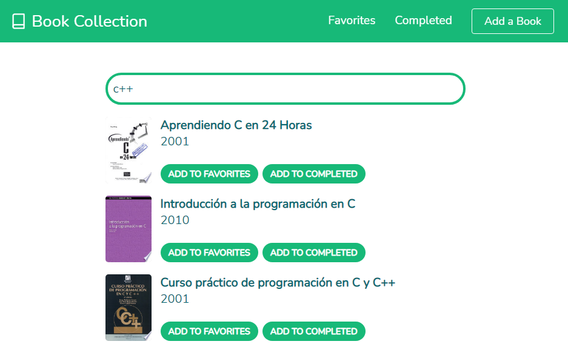
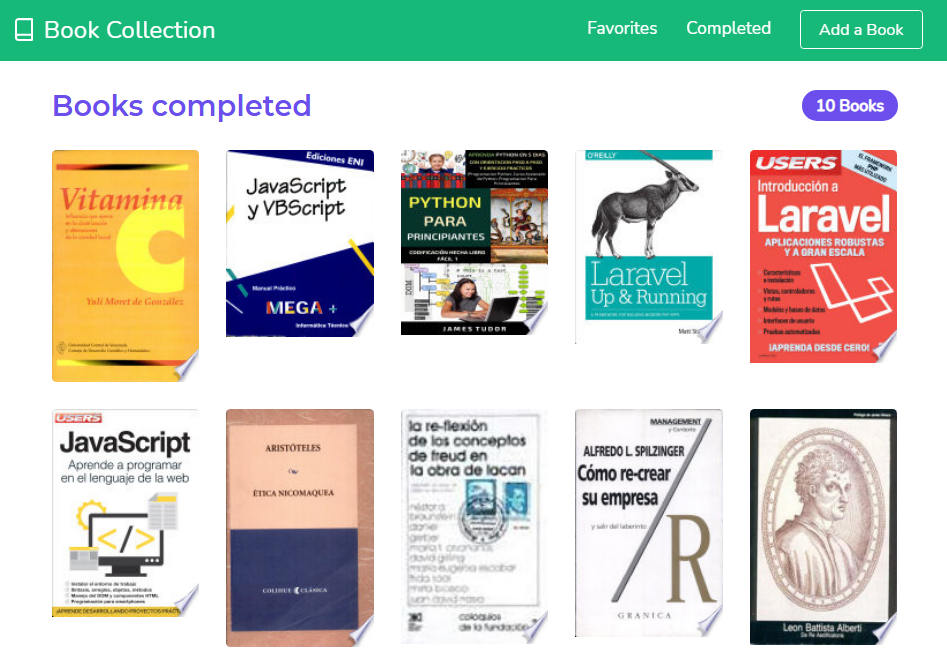

# Book Collection  ~ App
# https://book-collection-app.netlify.app
## Search any book using Google Books API!
Add a book to your list of 'favorites' or 'completed' if you already read that book. Delete from a list or swich books betwen them. Also you can find any book, read more info about it or even see the price on account of Google Books API.

### Code:
- JSX (React).
- Global Context.
- useReducer.
- Local Storage.
- React Router.
- Fetching Data.
- useEffect.
- React Icons.

### Features:
- Responsive web design.
- Reusable components.

### Captures:

